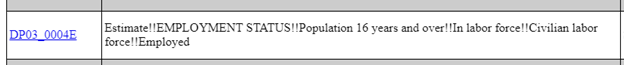
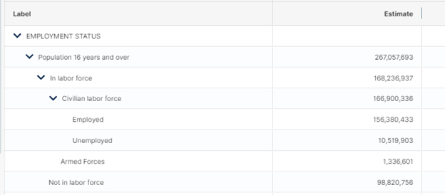

## Introduction

The American Community Survey managed by the U.S. Census Bureau produces a wealth of information that is commonly called upon to make data-informed decisions within Pierce County. However, accessing this information can be challenging. This primer covers at a high level the types of tables, year coverage, and geographies of some of the more popular data products. It then documents a Census API wrapper produced in-house, as well as points to external API wrappers.

## Tables

There are three main types of tables used in the American Communities Survey:

- [Data Profiles](https://www.census.gov/acs/www/data/data-tables-and-tools/data-profiles/)
- [Detailed Tables](https://data.census.gov/all?d=ACS+5-Year+Estimates+Detailed+Tables)
- [Subject Tables](https://www.census.gov/acs/www/data/data-tables-and-tools/subject-tables/)

Most data needs can be met by the data profiles, which are four tables containing information on social characteristics, economic characteristics, housing characteristics, and demographic data. As a general rule, first visit the link to the data profiles select the year and geography you are interested in, and click through these four tables to see if the data profiles contain the information you are interested in.

The subject tables are focused tables specific to a subject. The detailed tables are mostly a set of cross-tabulations of different variables collected in the subject and data profile tables. For example, if you wanted to know the median rent by the number of bedrooms in a housing unit, a good place to look is the detailed tables. As of writing, there are over 20,000 variables and ~1,500 tables.

**Table Characteristics**

Each table may cover a different time span, require several years of data to provide stable estimates, and/or cover a different geography. All three table types are created using 1- and 5-year estimates. The main distinction between these is that the 5-year estimates compile information from the past five years, but allow for finer geographic granularity. For example, the 2020 Economic Data Profile table using the 5-year estimates contains information on the median household income at the Census tract level, but these estimates are based off data from 2016-2020. The table below depicts the year and geography coverage of the different types of data products.


|     | County | Census Tract | Block-Group | Places | Zip Codes |
| --- | --- | --- | --- | --- | --- |
| Data Profile 5-year | 2009-present | 2009-present | N/A | 2009-present | 2009-present |
| Data Profile 1-year | 2005-present | N/A | N/A | N/A | N/A |
| Detailed 5-year | 2009-present | 2009-present | 2013-present | 2009-present | 2009-present |
| Detailed 1-year | 2005-present | N/A | N/A | N/A | N/A |
| Subject 5-year | 2010-present | 2010-present | N/A | 2010-present | 2010-present |
| Subject 1-year | 2010-present | N/A | N/A | N/A | N/A |

## How to find the table(s) and variable(s) you want

The API landing page for all types of tables can be found [here](https://www.census.gov/data/developers/data-sets/acs-5year.html), though we will try to break this page down into each of the three types of tables.

**Data Profiles**

Again the easiest way to tell if the data you are looking for is in the ACS is to start with the [Data Profiles](https://www.census.gov/acs/www/data/data-tables-and-tools/data-profiles/). There are four tables in the Data profiles: Social characteristics (table number DP02), Economic Characteristics (DP03), Housing Characteristics (DP04), and Demographic Characteristics (DP05), what and where DP01 is, is anyone's guess. If you see the variable you are interested in, then you need to find its variable code name, these codes are what are used to pull the data from the API. For example, the variable for the count of people over 16 employed in the civilian labor force is DP03\_0004E. Here DP03 is the table, 004 is the variable, and E indicates that it is the estimate (other types include PE = Percent Estimate, M=Margin of error, or PM = Percent Margin of Error). For the variable names of all data products described here everything before the first "\_" is the table name. 

The link below contains the list of all of the variables used across the four data profile tables for year 2021 and using the 5-year estimates. Note that the "acs5" can be changed to "acs1" and the year (in this case 2021) can be changed to any year between 2009 and the most recent available year (currently 2021).

- [https://api.census.gov/data/2021/acs/acs5/profile/variables.html](https://api.census.gov/data/2021/acs/acs5/profile/variables.html)

The descriptions in the above link are a little daunting, but are systematic and will make sense once we look at our specific example, DP03_004E. Below is a screen shot of the description, and below that is the Census Bureau's online table representation of DP03.






In light of this, the descriptions of the variables begin to make a bit more sense. We can understand the !! values to indicate nesting. Thus, DP03_004E is the count of employed people, considered to be in the civilian labor force, where the civilian labor force is nested under the total labor force, and where that labor force total is only for people 16 and older. It is a bit easier to start the other way though: among folks 16 years and older in the labor force, specifically the civilian labor force, DP03\_0004E is the employed count.

One very important thing to note is that every so often the ACS adds, removes, or slightly changes variable definitions. For this reason, it is imperative to look at the list of variables from the year you are interested in. This is done by just changing the year in the URL provided above.

The team maintains a list of some of the more common variable codes mapped to human-readable names for each year the five-year data profile estimates were available. This is located in the "ACS\_DataProfile\_VariableMapping.xlsx" file contained in the same folder as this primer.

**Subject Tables**

There are as of 06/01/2023 83 subject tables. A list of those tables with descriptions and links can be found [here](https://www.census.gov/acs/www/data/data-tables-and-tools/subject-tables/). Looking through this list and then selecting tables that could contain the variable you are interested in is, typically, the fastest way to find what you need.

More detailed documentation on the subject tables can be found at the URL below. Note that the "acs5" can be changed to "acs1" and the year (in this case 2021) can be changed to any year between 2010 and the most recent available year (currently 2021).  

- https://api.census.gov/data/2021/acs/acs5/subject.html

This link contains information on the geographies and all of the ~20K variables. The "Group List" here is just the list of tables. There is also a set of API call examples, should you need to troubleshoot some code. Given how many variables exist in the subject tables, it is recommended to look at the variable names from a single table, rather than the aggregated list provided in the link above.  

The link below shows an example URL for the variable names of subject table S0101. This link can be edited to find the variables of any table. Once you have the table code you want to look at the variables for, swap out the table code in the below link. For example, if we wanted to look at the "Educational Attainment" table we would swap out S0101 with S1501.

- [https://api.census.gov/data/2019/acs/acs5/subject/groups/S0101.html](https://api.census.gov/data/2019/acs/acs5/subject/groups/S0101.html)

**Detailed Tables**

I will be blunt, finding variables in the Detailed Tables is a pain. The quickest way, and yes quick here is a misnomer, is to go to [this](https://www.census.gov/programs-surveys/acs/technical-documentation/table-shells.html) page, download the existing list of tables. Then keyword search through the table titles to find potentially useful variables. Once you have the table code, then you can do one of two things:

1. Go to [this](https://data.census.gov/all?d=ACS+5-Year+Estimates+Detailed+Tables) page, search for your table with the code, click on the subsequent link, and examine the variables presented in the online table. If you find the variable you are interested in precede to step 2 below.
2. Pull up the variable list specific to the selected table. An example of the URL is listed below. As with the other URLs of this nature that we have seen, the year, ACS version, and in this case, table code can be changed. Here "B01001" is the table code used for the Detailed Table "Sex and Age". You really can skip step 1 if you feel like reading these opaque variable lists is your cup of tea.  

* [https://api.census.gov/data/2016/acs/acs5/groups/B01001.html](https://api.census.gov/data/2016/acs/acs5/groups/B01001.html)

## How to use the in-house API wrapper

The in-house API wrapper for the American Communities Survey data is a class called ACS contained within the AmericanCommunitiesSurvey.py script. At a minimum, to use the class the user needs to supply the year, the ACS versions (1 or 5-year estimates), the year, and the desired variables or tables. There is one main function within this class, the "call" function. Let's see an example of how this class works.      

<p><br/></p>

```python
from AmericanCommunitiesSurvey import ACS
import pandas as pd
classinstance = ACS(cen_key= "XXXXXXXX")
mydata = classinstance.call(geography='state', year='2020', acsversion='5', variables=['DP04_0005E'])
mydata.to_csv(".\THEFILEIWANTTOUSEINR.csv")
```  

That's it, we are done! Congratulations, you just pulled DP04\_0005E for all states in the country, whatever that is. For those of you new to Python, we can summarize the first three lines pretty quickly. The first line tells our script to find the file AmericanCommunitiesSurvey.py and load in the class object called ACS (this code assumes the AmericanCommunitiesSurvey.py file is in the same folder as the script we just wrote). The second line pulls in a package included within the base installation, so no need to download it. The third line creates a specific ACS class object and passes it our Census API key (you fill in the Xs of course). To be clear, most of the time you don't actually need this cen\_key argument and you could easily just write classinstance=ACS(). You only need an API key if you plan on making many, many calls to the API.

The fourth line is the tofu and potatoes. Here we are telling the wrapper we want our data at the state level from the 2020 year using the ACS 5-year estimates. The last line just writes our data frame to a csv. There are a few more optional arguments not shown here, so lets dive into some more formal documentation.

**Instantiation**

When creating an instance of an ACS class object you may feed your Census API key to the cen\_key argument. This is optional. You are allowed a substantial number of calls to the API without a key. If you plan on making many calls, then it would be good to provide a key to prevent frustration down the road. This key will be used in all calls for this object. It can be accessed in the 'cen\_key' attribute. The 'calls\_list' attribute stores all API calls made with this instance. It is useful for troubleshooting unsuccessful calls.

**Parameters for the**  _**call**_  **function**

* **geography**: TYPE string  
    * Determines what level to grab the data at, options are 'state', 'county', 'tract', 'blockgroup', 'zip'. The other location-based variables (state, county, place, tract, and blockgroup) specify which of the desired geographies to collect (more on this below). The default is 'county'. blockgroups can only be specified when performing a call to the detailed tables (see the table provided above). Zips cannot be sub-setted by state or county.  

* **year**: TYPE, string
    * What ACS year of the dataset to grab. The default is '2020'.  

* **acsversion**: TYPE, string optional
    * Options are '5' or '1'. The default is '5'.  

*  **variables**: TYPE, list of strings
    * This allows the user to select individual or multiples variables. For example, ['DP03\_0001E', 'B03002\_001E'] selects two variables from two different data tables and different data products (the Data Profiles and the Detailed tables). To select the entire table feed the variables list just the name of the table. In the above example, this would mean setting the variables argument to ['DP03', 'B03002']. The documentation in this repository should provide a primer on how to find the variables and tables you are interested in.  

* **state**: TYPE List of strings, optional
    * A list of fips state codes. The default is ['\*'], which will collect the geography specified above for all states. Washington State's FIPS is '53'.  

* **county**: TYPE List of strings , optional
    * A list of fips county codes. The default is ['\*'], which will collect the geography specified above for all counties. Pierce County's FIPs is '053'. Double 53s yay!  

* **place**: TYPE List of strings , optionl
    * A list of fips place codes. The default is ['\*'], which will collect the geography specified above for all Census designated places. Place codes can be found [here](https://www.census.gov/geographies/reference-files/time-series/geo/name-lookup-tables.html), Tacoma's fips is '70000'. When using a list of places, you must provide the state fips code that the place is nested under. For this reason, only places from a single state can be pulled at this time. This works for both incorporated and unincorporated Census designated places.  

* **tract**: TYPE List of strings, optional
    * List of fips tract codes. The default is ['\*'].  

* **blockgroup**: TYPE List of strings, optional;.
    *List of fips blockgroup codes. The default is ['\*']. Blockgroups can only be select from the Detailed tables. See the data product characteristics table above.

## Examples

```python
###############################
# Calling different geographies

e1 = ACS().call(geography='state', year='2020', acsversion='5',
                variables=['DP04_0005E'])

e2 = ACS().call(geography='county', year='2020', acsversion='5',
                variables=['DP04_0005E'])

e3 = ACS().call(geography='county', year='2020', acsversion='5',
                variables=['DP04_0005E'], county=['053'], state = ['53'])

###################################################################
# Calling all nested geographies under specified higher geo levels.

e4= ACS().call(geography='place', year='2020', acsversion='5',
               variables=['DP04_0001E'], place=['00135'], state=['53'])

e5 = ACS().call(geography='county', year='2020', acsversion='5',
                county=['*'], state = ['53', '41'], variables = ['DP02_0001E', 'DP04_0005E'])

# Calling across tables

e6 = ACS().call(geography='county', year='2020', acsversion='5',
                variables = ['DP02_0001E', 'B03002_004E',
                'S0101_C01_001E'], county='*', state = '53')

##########################
# Calling entire tables

e7 = ACS().call(geography='county', year='2020', acsversion='5',
                variables = ['DP02', 'B03002', 'S0101'], county='*', state = '53')  
```
<p><br/></p>
## Alternatives and more well maintained, but with less personal service**  **😊**** , APIs

- Python
  - [https://pypi.org/project/census/](https://pypi.org/project/census/)
  - [https://github.com/Census-ACS/cenpy](https://github.com/Census-ACS/cenpy)
- R
  - [https://github.com/Census-ACS/tidycensus](https://github.com/Census-ACS/tidycensus)
  - https://github.com/Census-ACS/censusapi

## Miscelanous Notes  
* Survey sample sizes are available for households in B98001 and for total individuals in B98003.